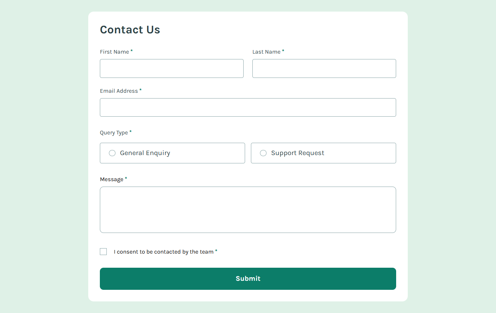

# Frontend Mentor - Contact form solution

This is a solution to the [Contact form challenge on Frontend Mentor](https://www.frontendmentor.io/challenges/contact-form--G-hYlqKJj). Frontend Mentor challenges help you improve your coding skills by building realistic projects.

## Table of contents

- [Overview](#overview)
  - [The challenge](#the-challenge)
  - [Screenshot](#screenshot)
  - [Links](#links)
- [My process](#my-process)
  - [Built with](#built-with)
  - [What I learned](#what-i-learned)
- [Author](#author)

## Overview

### The challenge

Users should be able to:

- Complete the form and see a success toast message upon successful submission
- Receive form validation messages if:
  - A required field has been missed
  - The email address is not formatted correctly
- Complete the form only using their keyboard
- Have inputs, error messages, and the success message announced on their screen reader
- View the optimal layout for the interface depending on their device's screen size
- See hover and focus states for all interactive elements on the page

### Screenshot

### Links

- Solution URL: [Add solution URL here](https://your-solution-url.com)
- Live Site URL: [Contact Form](https://gustavo2023.github.io/contact-form/)

## My process

### Built with

- Semantic HTML5 markup
- CSS custom properties
- Flexbox
- CSS Grid
- Mobile-first workflow
- JavaScript

### What I learned

This project provided valuable practice in building an accessible and interactive contact form. Key takeaways include:

- **Enhanced Accessibility with ARIA:**

  - Leveraging `aria-describedby` to programmatically link input fields with their specific error message `` elements. This ensures screen reader users receive clear, contextual error information when validation fails.
  - Using `aria-required="true"` to clearly indicate mandatory fields to assistive technologies.
  - Dynamically updating `aria-invalid` between `"true"` and `"false"` based on JavaScript validation results, providing real-time state information.
  - Employing `visually-hidden` class for elements like `<legend>` or descriptive paragraphs that should be available to screen readers but not visually displayed.

- **Client-Side Validation and Feedback:**

  - Implementing robust client-side validation using JavaScript to check for empty required fields, correct email format, radio button selection, and checkbox consent.
  - Providing immediate visual feedback by adding/removing an `.error-state` class to style invalid inputs (e.g., red borders) and displaying the corresponding error message ``.
  - Using a dedicated toast notification (`.toast-container`) that appears upon successful submission, offering clear confirmation to the user. The toast is initially hidden (`display: none`) and shown via JavaScript.

- **Custom Form Controls:**

  - Styling radio buttons and checkboxes using CSS `appearance: none` to hide the default browser controls and creating custom visuals with borders, background images (`::before` pseudo-element for radio buttons, `background-image` for checkboxes), while ensuring functionality and focus states remain intact.
  - Making the entire container (`.radio-container`) clickable and visually responsive to selection using `:has(:checked)`.

- **Responsive Layout:**

  - Utilizing CSS Grid (`display: grid`, `grid-template-columns`, `grid-column`) within media queries (`@media (min-width: ... )`) to create adaptive layouts, such as arranging user information fields into two columns on larger screens while keeping them stacked on smaller ones.
  - Employing Flexbox for alignment and spacing within components like input containers, radio groups, and the toast message.

Overall, the project reinforced the importance of combining semantic HTML, thoughtful ARIA implementation, CSS for styling and layout, and JavaScript for interactivity and validation to create forms that are both functional and accessible to all users.

## Author

- Frontend Mentor - [@gustavo2023](https://www.frontendmentor.io/profile/gustavo2023)
